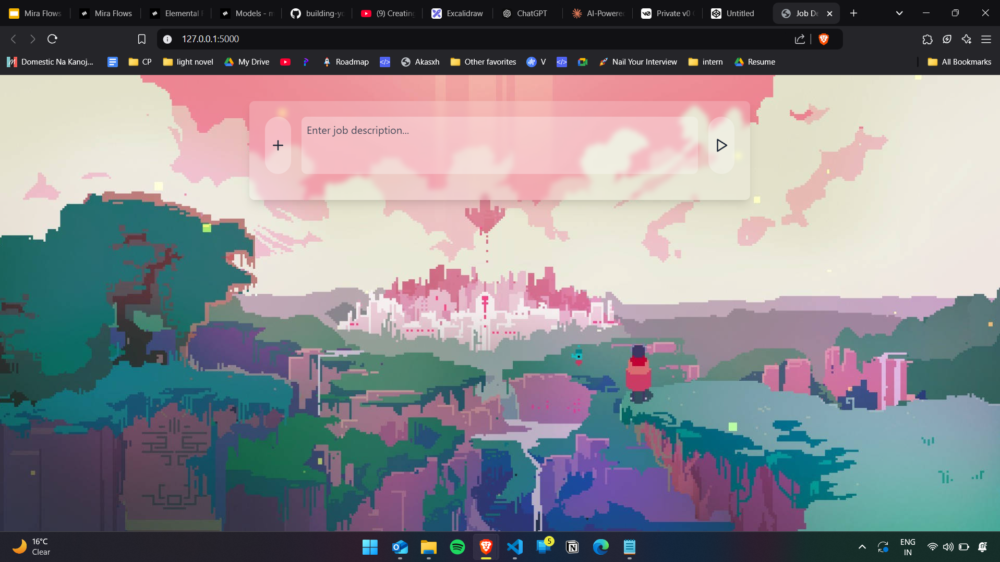
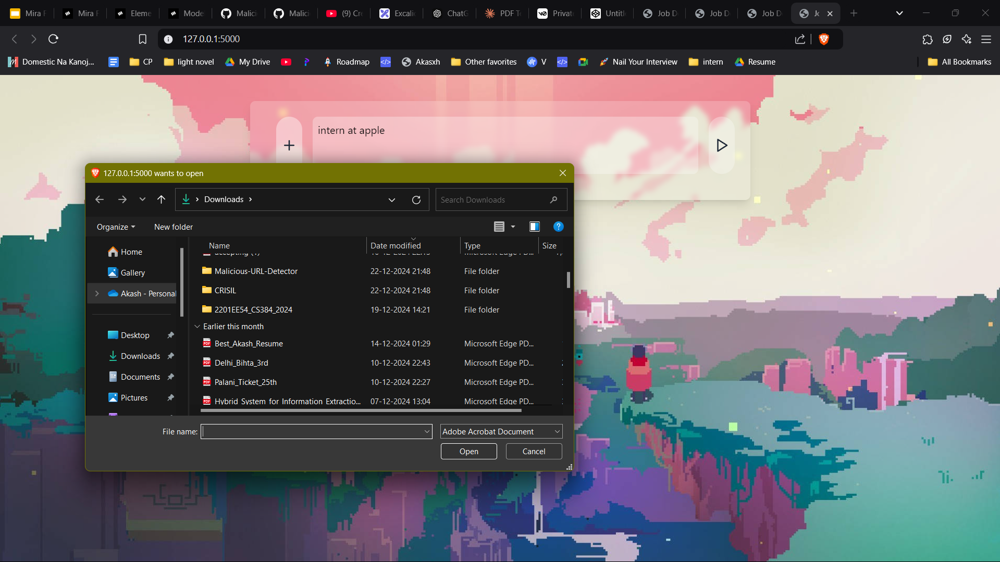
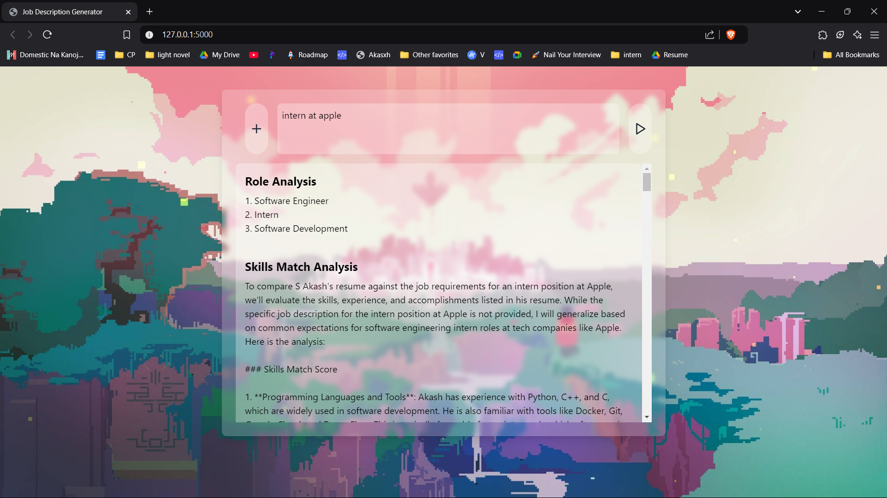

# JobMatchAI-Resume-Optimizer

**JobMatchAI-Resume-Optimizer** is an AI-powered web application designed using ***MIRA*** to help job seekers optimize their resumes by matching them with job descriptions. The application allows users to upload their resume and input a job description to get detailed feedback on how well their resume aligns with the job posting.

### Features:
- **Resume Upload**: Users can upload their resume in PDF or text format.
- **Job Description Input**: Users can write or paste a job description.
- **AI Optimization**: The app uses machine learning to analyze and provide feedback on the resume based on the job description.
- **Real-Time Suggestions**: Receive suggestions on how to optimize your resume for the given job.

## How It Works

1. **Upload Your Resume and Write a Job Description**
   - On the frontend, click the **`+`** button to upload your resume in PDF format.
   - Write the job description in the provided text box.

   

2. **Generate Insights**
   - Once the resume is uploaded and the job description is written, click the **Play** button.
   - Wait for a while as the system processes your inputs.

   

3. **View the Analysis**
   - After processing, the system will generate a thorough analysis, as depicted below.

   

