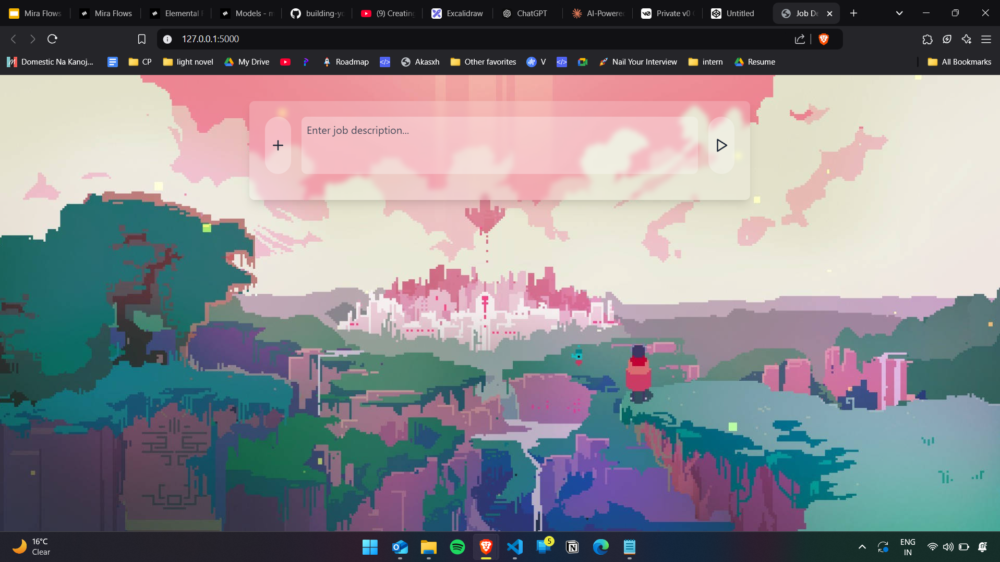

# JobMatchAI-Resume-Optimizer

**JobMatchAI-Resume-Optimizer** is an AI-powered web application designed to help job seekers optimize their resumes by matching them with job descriptions. The application allows users to upload their resume and input a job description to get detailed feedback on how well their resume aligns with the job posting.

### Features:
- **Resume Upload**: Users can upload their resume in PDF or text format.
- **Job Description Input**: Users can write or paste a job description.
- **AI Optimization**: The app uses machine learning to analyze and provide feedback on the resume based on the job description.
- **Real-Time Suggestions**: Receive suggestions on how to optimize your resume for the given job.

### Screenshots:

