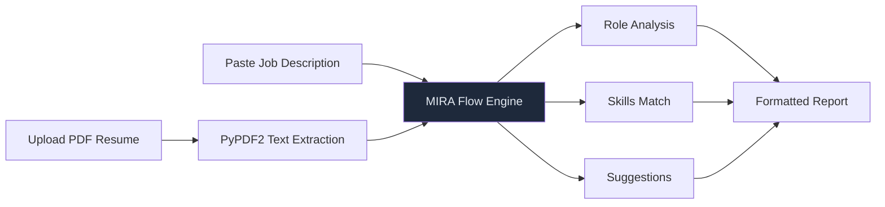

# JobMatchAI Resume Optimizer

Resume optimization tool that analyzes PDF resumes against job descriptions using the MIRA SDK. Extracts text from uploaded resumes, runs them through a deployed flow on the Mira platform, and returns structured feedback covering role analysis, skills matching, and improvement suggestions.


```mermaid
flowchart LR
    A[Upload PDF Resume] --> B[PyPDF2 Text Extraction]
    C[Paste Job Description] --> D[MIRA Flow Engine]
    B --> D
    D --> E[Role Analysis]
    D --> F[Skills Match]
    D --> G[Suggestions]
    E --> H[Formatted Report]
    F --> H
    G --> H

    style D fill:#1e293b,color:#e2e8f0
```

## Features

- **PDF resume parsing** -- Extracts text from multi-page PDF resumes using PyPDF2
- **MIRA-powered analysis** -- Sends resume + job description to a deployed MIRA flow for evaluation
- **Structured output** -- Returns role analysis, skills match breakdown, and actionable optimization suggestions
- **Web interface** -- Flask app with upload widget and real-time results display

## Quick Start

```bash
git clone https://github.com/Akasxh/jobmatchai-resume-optimizer.git
cd jobmatchai-resume-optimizer/MIRA

python -m venv .venv && source .venv/bin/activate
pip install -r ../requirements.txt

python app.py
```

## How It Works

1. Upload your resume (PDF) via the web interface
2. Paste the target job description
3. The system extracts resume text and sends both inputs to the MIRA flow
4. Receive a detailed analysis with role fit assessment, skills gap identification, and concrete improvement suggestions

## Project Structure

```
jobmatchai-resume-optimizer/
├── MIRA/
│   ├── app.py               # Flask web application
│   ├── deploy-flow.py        # MIRA flow deployment script
│   ├── Upload.py             # File upload handling
│   ├── local_test.py         # Local testing script
│   └── marketplace_test.py   # Marketplace integration test
├── requirements.txt          # Python dependencies
└── image/                    # Screenshots
```

## Tech Stack

| Component | Technology |
|-----------|-----------|
| Web Framework | Flask |
| PDF Processing | PyPDF2 |
| NLP Pipeline | MIRA SDK (hosted flow) |
| NLP Backend | spaCy (en_core_web_sm) |
| Frontend | Jinja2 templates, HTML/CSS |

## License

MIT
